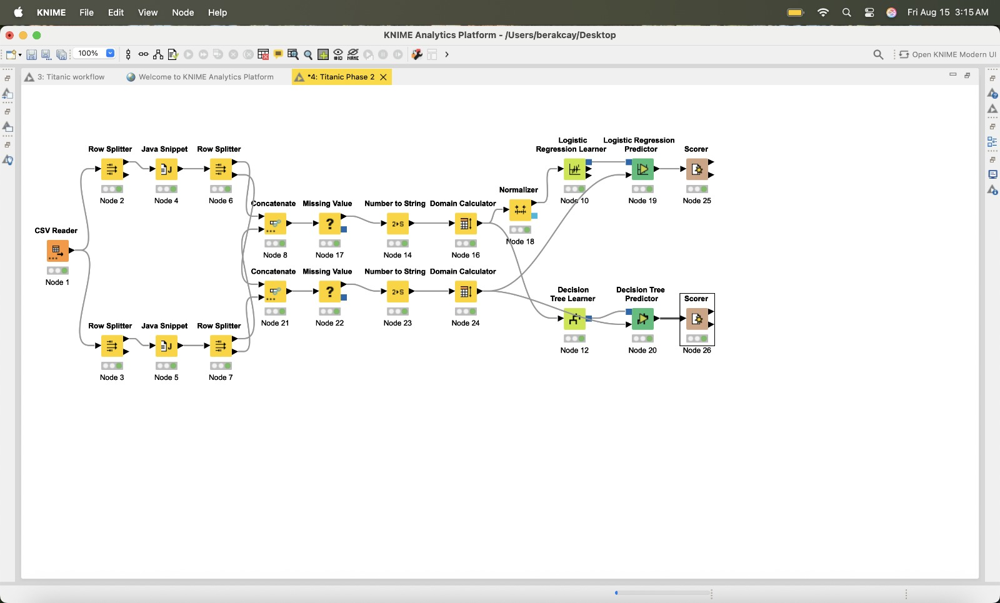
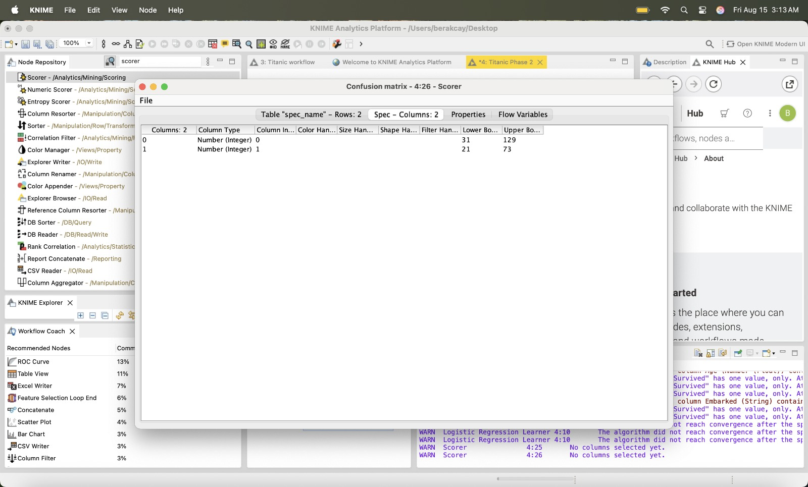

# Titanic Survival Prediction (KNIME)

A machine learning classification project that predicts passenger survival on the Titanic dataset using structured data preprocessing and model evaluation workflows built in KNIME.

---

## Overview

This project focuses on building an end-to-end machine learning workflow including data preprocessing, feature preparation, model training, and evaluation.

The workflow was designed to compare the performance of Logistic Regression and Decision Tree models on the Titanic dataset.

---

## Key Contributions

- Designed and built the full KNIME workflow pipeline  
- Performed data preprocessing, including handling missing values and feature transformations  
- Implemented and evaluated classification models  
- Analyzed model performance using confusion matrices and accuracy metrics  

---

## Workflow

The workflow includes:

- Data loading and splitting  
- Missing value handling  
- Feature transformation and normalization  
- Model training (Logistic Regression & Decision Tree)  
- Model evaluation using Scorer nodes  

---

## Model Results

### Confusion Matrix

### Accuracy Metrics

---

## Tech Stack

KNIME  
Machine Learning (Classification)  
Logistic Regression  
Decision Tree  
Data Preprocessing  

---

## How It Works

The dataset is first cleaned and prepared by handling missing values and transforming categorical variables. The data is then split into training and testing sets.

Two models are trained:

- Logistic Regression  
- Decision Tree  

Each model is evaluated using confusion matrices and accuracy metrics, allowing direct comparison of performance.

---

## Project Context

This project was developed as part of the MSAI program. The workflow design, model implementation, and performance analysis were built and executed as a structured machine learning pipeline.

---

## Key Insight

This project highlights how data preprocessing and feature engineering directly impact model performance and demonstrates the differences between linear and tree-based models in classification tasks.
